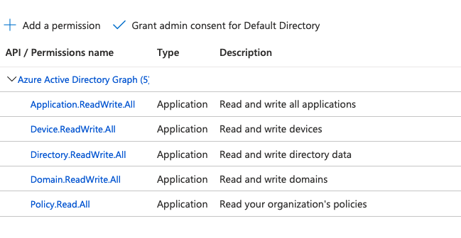

# Automation Congnito User Pool + Azure AD by Terraform

* Creating AWS Cognito user pool
* Creating AWS AppClient
* Creating Azure AD
* Configuring Enterprise Application
* Configuring AWS Congnito user pool IdP

## Set envs
```shell script
export AWS_ACCESS_KEY_ID=
export AWS_SECRET_ACCESS_KEY=
export ARM_CLIENT_ID=
export ARM_TENANT_ID=
export ARM_CLIENT_SECRET=
```

## API Permissions


## Defining vars
```shell script
export TF_VAR_tenant_id=""
export TF_VAR_aws_region=""
export TF_VAR_cognito_user_pool_name=""
export TF_VAR_domain=""
export TF_VAR_cognito_user_pool_client_name=""
export TF_VAR_azuread_application_name=""
export TF_VAR_cert_expire_time=""
export TF_VAR_cognito_callbackurls=[""]
// ^list 
```